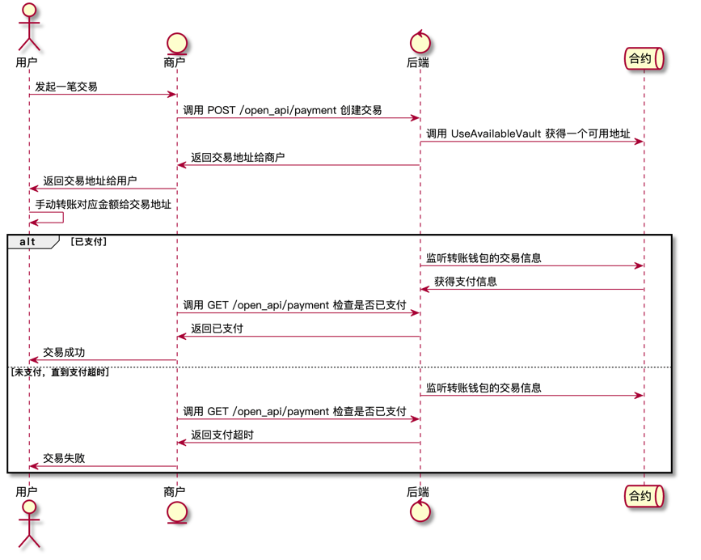

## Airswift DeFi Gateway Backend

### How program works
1. 安装Golang环境(**1.19及以上版本**) [安装文档](https://go.dev/doc/install)
2. 进入项目目录
3. 执行`go build veric-backend`命令进行编译
4. 执行`chmod +x veric-backend`命令，添加可执行权限

### How payment stream works

### How to check lack of liquidity
#### 当所有商户某token可提现余额最大值 > LP中对应token实际余额
1. 通过接口`GetCurrencyMaxBalanceList`获得**所有商户某token可提现余额最大值**
2. 通过LPManager的`getEthPoolBalance`与`getPoolBalanceViaToken`方法传入token的合约地址获取**LP中对应token实际余额**
3. 对比两者的大小，判断是否需要报警

#### 当LP中某token所有用户质押额最大值 > LP中对应token实际余额
1. 通过LPManager获得**某token所有用户质押额最大值**(暂无此方法，需要king哥额外支持)
2. 通过LPManager的`getEthPoolBalance`与`getPoolBalanceViaToken`方法传入token的合约地址获取**LP中对应token实际余额**
3. 对比两者的大小，判断是否需要报警